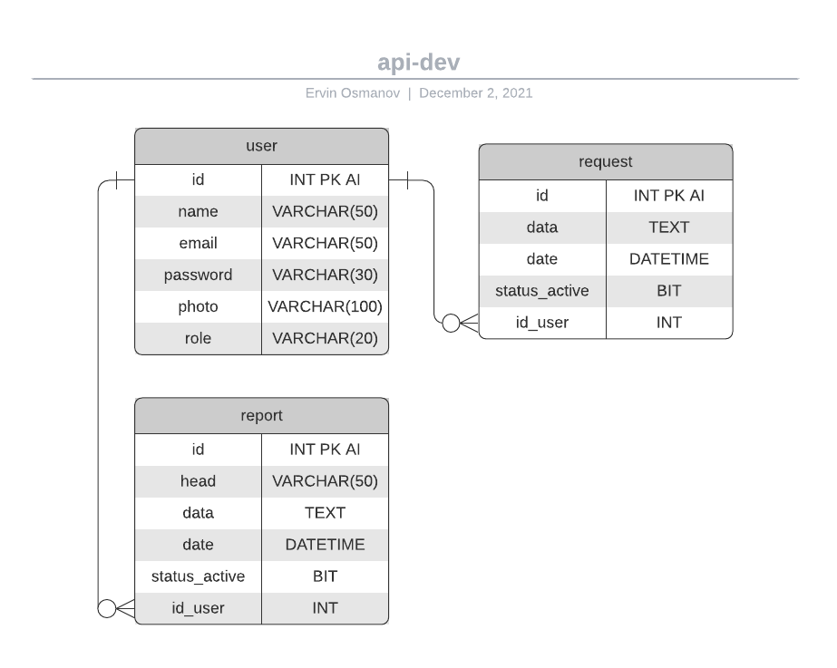
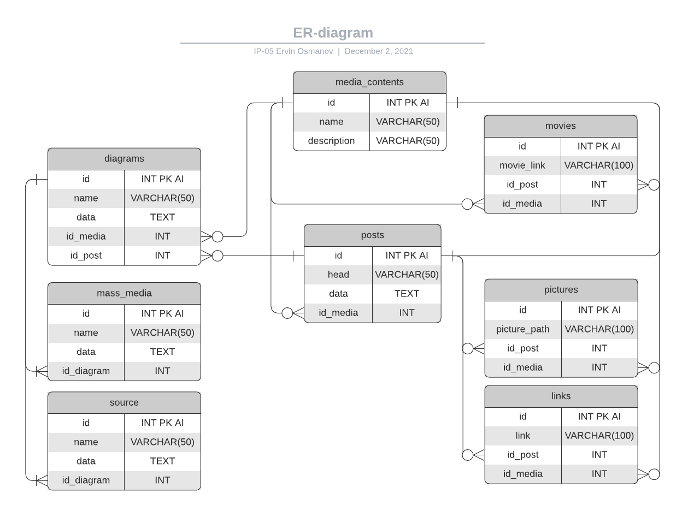

# Проєктування бази даних

В рамках проекту розробляється: 
- модель бізнес-об'єктів 
- ER-модель
- реляційна схема

## ER-Model

### User
```
@startuml

entity users <<ENTITY>> {
	id:INT
	name:VARCHAR
	email:VARCHAR
	password:VARCHAR
	photo:VARCHAR
	role:VARCHAR
}

entity reports <<ENTITY>> {
    id:INT
    head:VARCHAR
    description:TEXT
    date:DATETIME
    status_active:BIT
    id_user:INT
}

entity questions <<ENTITY>> {
    id:INT
    data:TEXT
    date:DATETIME
    status_active:BIT
    id_user:INT
}

users "1,1" -- "0,*" questions
users "1,1" - "0,*" reports

@enduml
```
### Media-content
```
@startuml

entity media_contents <<ENTITY>> {
    id INT PRIMARY KEY AUTO INCREMENT
    name VARCHAR
    description VARCHAR
}

entity posts <<ENTITY>> {
    id INT PRIMARY KEY AUTO INCREMENT
    hea` VARCHAR
    data TEXT
    id_media INT
}

entity movies <<ENTITY>> {
    id INT PRIMARY KEY AUTO INCREMENT
    movie_link VARCHAR
    id_post INT
    id_media INT
}

entity pictures <<ENTITY>> {
    id INT PRIMARY KEY AUTO INCREMENT
    picture_path VARCHAR
    id_post INT
    id_media INT
}

entity links <<ENTITY>> {
    id INT PRIMARY KEY AUTO INCREMENT
    link VARCHAR
    id_post INT
    id_media INT
}

entity diagrams <<ENTITY>> {
    id INT PRIMARY KEY AUTO INCREMENT
    name VARCHAR
    data TEXT
    id_media INT
    id_post INT
}

entity mass_media <<ENTITY>> {
    id INT PRIMARY KEY AUTO INCREMENT
    name VARCHAR
    data TEXT
    id_diagram INT
}

entity source <<ENTITY>> {
    id INT PRIMARY KEY AUTO INCREMENT
    name VARCHAR
    data TEXT
    id_diagram INT
}

media_contents "1,1" -- "0,*" diagrams
media_contents "1,1" - "0,*" posts
media_contents "1,1" -- "0,*" movies
media_contents "1,1" - "0,*" pictures
media_contents "1,1" -- "0,*" links
posts "1,1" -- "0,*" diagrams
posts "1,1" -- "0,*" movies
posts "1,1" -- "0,*" pictures
posts "1,1" -- "0,*" links
diagrams "1,1" -- "1,*" mass_media
diagrams "1,1" -- "1,*" source

@enduml
```
## Relational Schema

<p align="center">
  
  
</p>

## MySql realization 

### Users

```sql
CREATE TABLE users (
  id INT PRIMARY KEY AUTO INCREMENT,
  name VARCHAR(50),
  email VARCHAR(50),
  password VARCHAR(30),
  photo VARCHAR(100),
  role VARCHAR(20)
);

CREATE TABLE reports (
  id INT PRIMARY KEY AUTO INCREMENT,
  head VARCHAR(50),
  data TEXT,
  date DATETIME,
  status_active BIT,
  id_user INT,
  FOREIGN KEY (id_user) REFERENCES users(id)
);

CREATE TABLE questions (
  id INT PRIMARY KEY AUTO INCREMENT,
  data TEXT,
  date DATETIME,
  status_active BIT,
  id_user INT,
  FOREIGN KEY (id_user) REFERENCES users(id)
);
```

### Media-content

```sql
CREATE TABLE media_contents (
  id INT PRIMARY KEY AUTO INCREMENT,
  name VARCHAR(50),
  description VARCHAR(50)
);

CREATE TABLE posts (
  id INT PRIMARY KEY AUTO INCREMENT,
  head VARCHAR(50),
  data TEXT,
  id_media INT,
  FOREIGN KEY (id_media) REFERENCES media_contents(id)
);

CREATE TABLE movies (
  id INT PRIMARY KEY AUTO INCREMENT,
  movie_link VARCHAR(100),
  id_post INT,
  id_media INT,
  FOREIGN KEY (id_post) REFERENCES posts(id),
  FOREIGN KEY (id_media) REFERENCES media_contents(id)
);

CREATE TABLE diagrams (
  id INT PRIMARY KEY AUTO INCREMENT,
  name VARCHAR(50),
  data TEXT,
  id_media INT
  id_post INT,
  FOREIGN KEY (id_media) REFERENCES media_contents(id),
  FOREIGN KEY (id_post) REFERENCES posts(id)
);

CREATE TABLE mass_media (
  id INT PRIMARY KEY AUTO INCREMENT,
  name VARCHAR(50),
  data TEXT,
  id_diagram INT,
  FOREIGN KEY (id_diagram) REFERENCES diagrams(id)
);

CREATE TABLE source 
  id INT PRIMARY KEY AUTO INCREMENT,
  name VARCHAR(50),
  data TEXT,
  id_diagram INT,
  FOREIGN KEY (id_diagram) REFERENCES diagrams(id)
);

CREATE TABLE links (
  id INT PRIMARY KEY AUTO INCREMENT,
  link VARCHAR(100),
  id_post INT,
  id_media INT,
  FOREIGN KEY (id_post) REFERENCES posts(id),
  FOREIGN KEY (id_media) REFERENCES media_contents(id)
);

CREATE TABLE pictures (
  id INT PRIMARY KEY AUTO INCREMENT,
  picture_path VARCHAR(100),
  id_post INT
  id_media INT,
  FOREIGN KEY (id_post) REFERENCES posts(id),
  FOREIGN KEY (id_media) REFERENCES media_contents(id)
);

```
